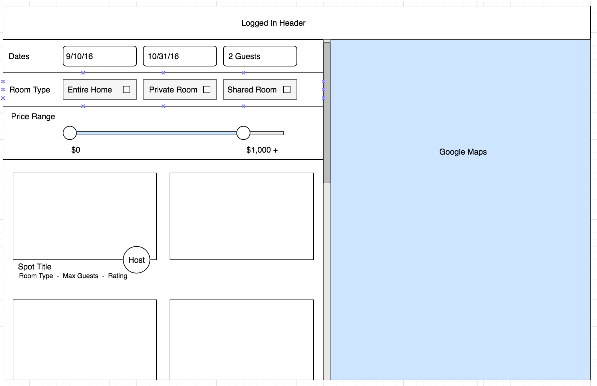

# Couchbnb

[Couchbnb live][heroku]

[heroku]: https://couchbnb.herokuapp.com

Couchbnb is a full-stack web application inspired by Couchsurfing. It was built on Ruby on Rails, PostgreSQL, and React/Redux.

## Features

### Vacation Spots

  The spots are stored in a singe table in the database, which contains
columns for 'id', 'host_id', 'title', 'description', 'location', 'latitude', 'longitude', and various amenities the user can filter by to their liking.

  Spots are rendered in the search and spot component.In the search,
the spots are filtered by location, check-in/check-out date, room type,
and price per night.



To filter by location, Google's geocode API is used with Ajax to fetch the latitude and longitude coordinates of the city the user searched for, and the map panned to the new lat/lng coordinates. The remaining filters were implementing using ActiveRecord SQL queries.

````
  componentWillReceiveProps(nextProps) {
    if (nextProps.location.lat !== lat && nextProps.location.lng !== lng) {
      lat = nextProps.location.lat;
      lng = nextProps.location.lng;

      this._moveToLocation(lat, lng);
    }
  }

  _moveToLocation(lat, lng) {
    let center = new google.maps.LatLng(lat, lng);
    this.map.panTo(center);
    this.map.setZoom(13);
  }

//

  spots = bounds ? Spot.in_bounds(params[:bounds]) : Spot.all

  if (params[:minPrice] && params[:maxPrice])
    spots = spots.where(price_per_night: price_range)
  end
````


### Bookings

Users may make booking requests using the booking form in the spot's show page. The host of that spot will receive a notification, and they may approve or deny the request.

## Soon to come:

### User profiles

Users wil have a profile page with their contact information, and reviews of them.

### Reviews

After a guest's vacation stay, both the host and guest will receive a notification to review the experience. The guest's review will be displayed in the spot's show page and host's profile page. The host's review will be displayed in the guest's profile page.

### Messages

Users will be able to send and receive messages.
